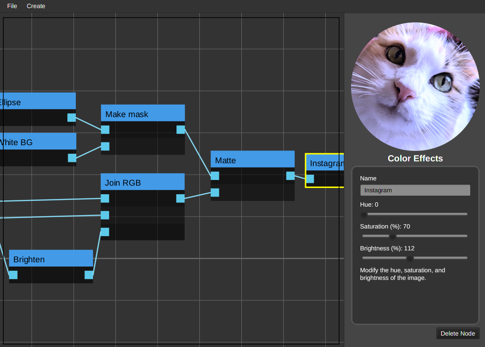

# IMGFLOW

## A Graphical Node-Based Image Editor built with JavaFX



This was a school project for CS 371 Software Development at New Mexico State University

### Contributors
- Austin Bos
- Cameron Tauxe
- Kyle Jackson
- Jacob Dickens
- **Professor:** Jonathan Cook

## Instructions

This project is built using Maven, please make sure it is installed first

**To build:**
```
mvn package*
```
**To run:**
```
java -jar target/imgflow-1.0-jar-with-dependencies.jar
```
